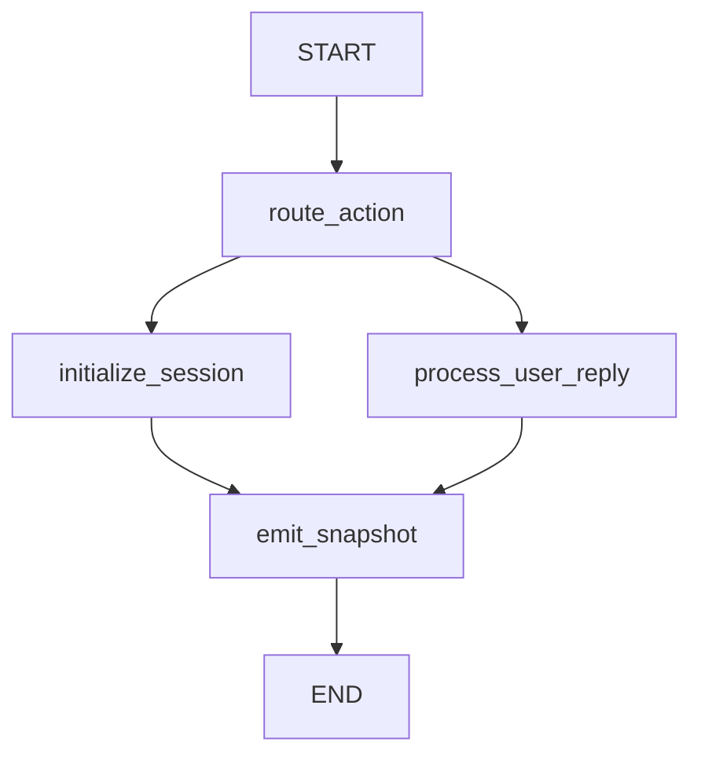
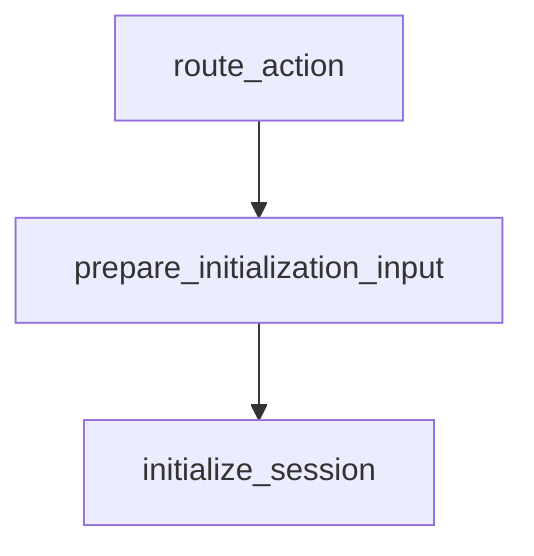
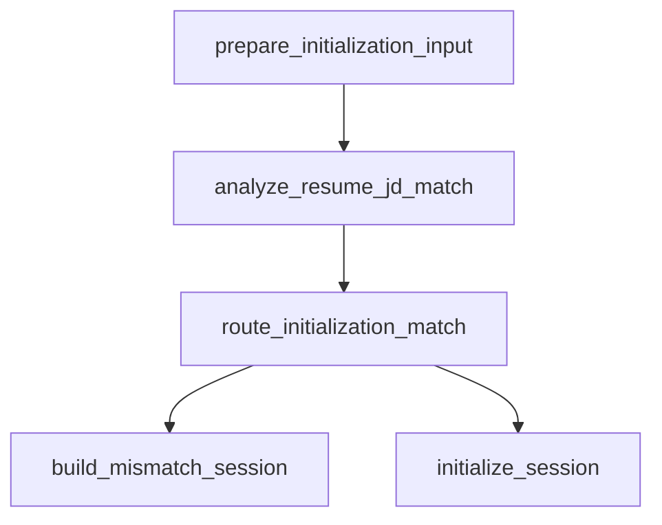
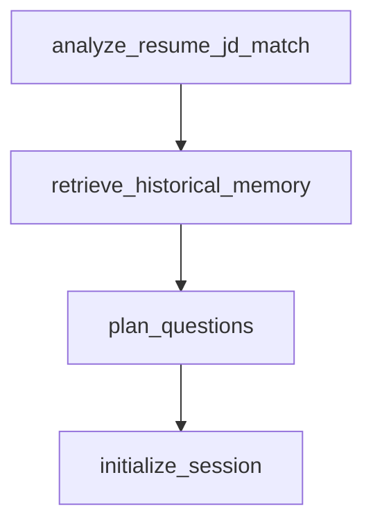
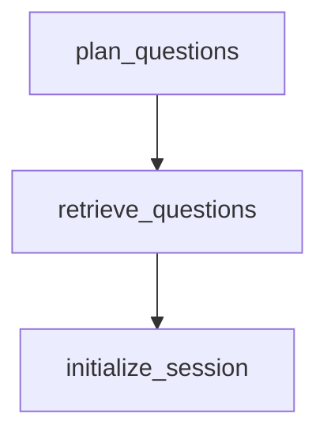
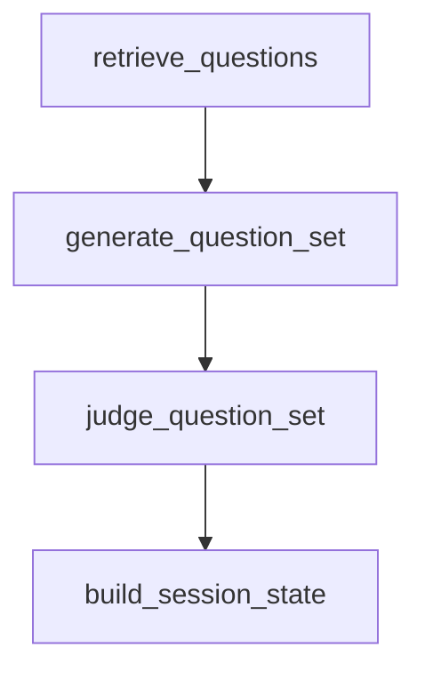
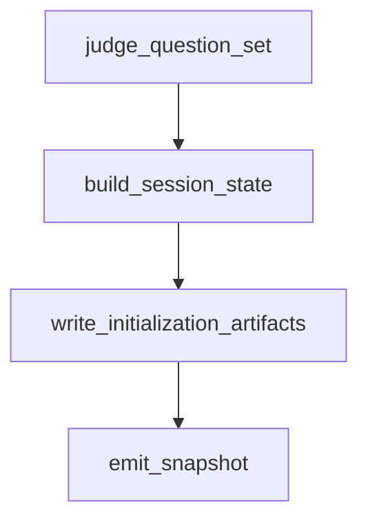
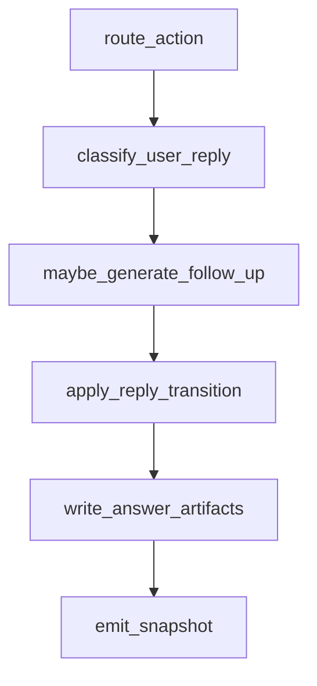
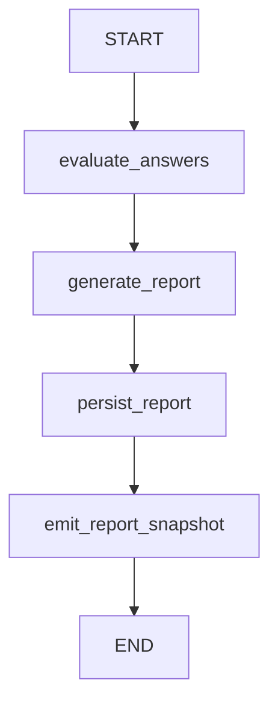
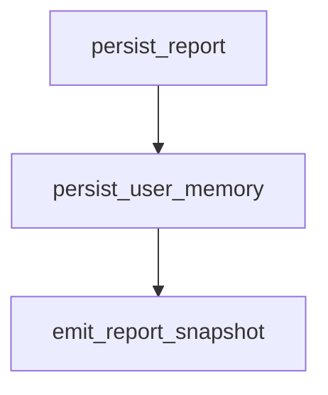

# LangGraph Node 拆分执行计划

## 目标

把当前过粗的 LangGraph 主流程拆成更清晰、可观测、可单独验证的小节点，同时保持现有 BFF/frontend SSE contract、checkpoint 行为、报告后台生成语义不变。

当前主图只有：



目标不是一次性大改，而是以每次约 150-250 行代码变更推进。每一步必须能独立通过测试，并且即使中途停止，也不应该破坏可运行流程。

## 全局约束

- 每次开始实现一个 numbered step 前，先重新读取 host repo 的 `.github/instructions/langgraph-architecture.instructions.md`。
- 不改 Mastra 归档 runtime。
- FastAPI handler 继续只做 HTTP/SSE 边界，不把业务状态推进写进 `app.main`。
- 复杂业务仍放在 `app.domain`；graph node 只负责 orchestration、state 聚合、span、安全 metadata。
- SSE snapshot contract 不变：`assistantReply`、`phase`、`activeRoundType`、`activeNodeTopic`、`finalReportReady`、`progress` 必须保留。
- 报告生成仍由 FastAPI background task 触发，不在用户答题 stream invoke 中同步生成完整报告。
- 每次 LangGraph runtime 代码改动后运行 `project-architecture-sync` skill，并在 host repo 记录 guard。

## Step 1: 引入初始化中间状态和兼容测试

### 改动范围

- `src/app/graphs/interview_graph.py`
- `tests/unit/test_interview_graph.py`

### 代码变更目标

扩展 `InterviewGraphState`，加入后续拆分会用到的初始化中间字段，但暂时不改变 graph wiring：

- `initialization_input`
- `initialization_resources`
- `professional_question_plan`
- `historical_memory`
- `resume_jd_match_analysis`
- `judge_trace`

这些字段先作为兼容铺垫，不改变 `initialize_session_node()` 的行为。测试只验证 graph state 能携带额外字段，不影响既有 snapshot。

### 预计改动量

约 80-160 行。

### 验证

```powershell
.venv\Scripts\python -m pytest tests\unit\test_interview_graph.py
.venv\Scripts\ruff check src/app/graphs/interview_graph.py tests/unit/test_interview_graph.py
```

### 验收点

- 现有初始化、答题、报告后台 runner 测试仍通过。
- 新增 state 字段不改变前端 snapshot shape。
- checkpoint 旧 state 缺少这些字段时仍可恢复。

## Step 2: 抽出 `prepare_initialization_input` node

### 改动范围

- `src/app/graphs/interview_graph.py`
- 可选新增 `src/app/graphs/nodes/initialization.py`
- `tests/unit/test_interview_graph.py`

### 代码变更目标

在 graph 中增加第一个初始化子节点：



该 node 只做轻量输入准备：

- 保存 `thread_id`
- 保存 `raw_kickoff_message`
- 解析 structured start 是否存在
- 解析 selected direction / response language 所需的最小元信息

本步不要移动 RAG、LLM、memory 或 session 构建逻辑，只为后续拆分建立稳定入口。

### 预计改动量

约 150-220 行。

### 验证

```powershell
.venv\Scripts\python -m pytest tests\unit\test_interview_graph.py
.venv\Scripts\python -m pytest tests\integration\test_interview_short_flow.py
.venv\Scripts\ruff check src/app/graphs tests/unit/test_interview_graph.py
```

### 验收点

- 新 graph wiring 正确进入初始化子节点。
- 旧的完整初始化结果不变。
- trace metadata 不包含简历、JD、回答正文。

## Step 3: 抽出 `analyze_resume_jd_match` node

### 改动范围

- `src/app/domain/interview_initialization_pipeline.py`
- `src/app/graphs/nodes/initialization.py`
- `src/app/graphs/interview_graph.py`
- `tests/unit/test_interview_graph.py`
- 可能补充 `tests/unit/test_interview_initialization_pipeline.py`

### 代码变更目标

把简历/JD 匹配分析从 `resolve_interview_initialization_resources()` 的大流程中拆出为 graph node：



本步只拆匹配分析和 mismatch 分支判定。RAG、memory、生成、裁判仍可保留在原 `initialize_session` 内。

### 预计改动量

约 180-260 行；如果超过 260 行，先只做 node wrapper 和 tests，不移动太多 domain helper。

### 验证

```powershell
.venv\Scripts\python -m pytest tests\unit\test_interview_graph.py -k "mismatch or initialize"
.venv\Scripts\python -m pytest tests\contract\test_unit00_golden_transcripts.py
.venv\Scripts\ruff check src/app/domain/interview_initialization_pipeline.py src/app/graphs
```

### 验收点

- JD 非空且 `resumeJdMatch` 为空时仍直接返回 `completed` mismatch snapshot。
- mismatch 不进入 RAG、不生成题、不触发报告生成。
- 正常匹配路径输出和拆分前一致。

## Step 4: 抽出 `retrieve_historical_memory` 和 `plan_questions` nodes

### 改动范围

- `src/app/graphs/nodes/initialization.py`
- `src/app/graphs/interview_graph.py`
- `src/app/domain/interview_initialization_pipeline.py`
- `tests/unit/test_interview_graph.py`
- 可能补充 memory/planner 相关 unit tests

### 代码变更目标

把历史记忆召回和问题规划拆成两个连续 node：



`retrieve_historical_memory` 负责：

- respect `settings.enableHistoricalMemory`
- structured `userId` 优先
- fallback 到 `INTERVIEW_MEMORY_USER_ID`
- 无 memory 或 retrieval fallback 不阻断初始化

`plan_questions` 负责：

- 使用 settings、normalized skills、project topics、JD、match analysis
- 将 historical reinforcement signals 注入 planner
- 不增加主问题总数

### 预计改动量

约 180-250 行。

### 验证

```powershell
.venv\Scripts\python -m pytest tests\unit -k "memory or planner or initialize"
.venv\Scripts\python -m pytest tests\integration\test_interview_short_flow.py
.venv\Scripts\ruff check src/app/graphs src/app/domain
```

### 验收点

- `enableHistoricalMemory=false` 时跳过 memory node 的外部读取。
- 有历史弱项时 planner 仍能生成 `review-weakness` 或等价强化 plan。
- 问题数量不因历史 memory 增加。

## Step 5: 抽出 `retrieve_questions` node

### 改动范围

- `src/app/graphs/nodes/initialization.py`
- `src/app/graphs/interview_graph.py`
- `src/app/domain/interview_initialization_pipeline.py`
- `tests/unit/test_interview_graph.py`
- RAG 相关 unit tests

### 代码变更目标

把 RAG 召回拆成单独 node：



该 node 输出：

- `professionalQuestions` retrieved candidates
- `projectQuestions` retrieved candidates
- `recallTraces`

候选补齐、LLM 生成和裁判暂时还留在后续初始化逻辑中。

### 预计改动量

约 150-230 行。

### 验证

```powershell
.venv\Scripts\python -m pytest tests\unit -k "rag or recall or initialize"
.venv\Scripts\python -m pytest tests\contract\test_unit00_golden_transcripts.py
.venv\Scripts\ruff check src/app/graphs src/app/domain/question_retriever.py
```

### 验收点

- `recall_traces` 仍写入 graph state。
- RAG sample artifact 内容不丢失 score breakdown、matched metadata、duplicate 标记。
- RAG 失败或空结果时 fallback 题目仍能补齐。

## Step 6: 抽出 `generate_question_set` 和 `judge_question_set` nodes

### 改动范围

- `src/app/graphs/nodes/initialization.py`
- `src/app/graphs/interview_graph.py`
- `src/app/domain/interview_initialization_pipeline.py`
- `tests/unit/test_interview_graph.py`
- question generator / critic 相关 tests

### 代码变更目标

把题目补齐、LLM 生成、裁判拆成两个节点：



`generate_question_set` 负责：

- retrieved candidates 去重
- fallback 补齐 desired count
- 调用 `generate_initialization_question_set`
- 保存 `generation_trace`

`judge_question_set` 负责：

- 调用 `judge_initialization_question_set`
- 保存 `judge_trace`
- 输出最终 professional/project question candidates

### 预计改动量

约 180-260 行。

### 验证

```powershell
.venv\Scripts\python -m pytest tests\unit -k "question or judge or initialize"
.venv\Scripts\python -m pytest tests\integration\test_interview_short_flow.py
.venv\Scripts\ruff check src/app/graphs src/app/domain/question_generator.py src/app/domain/question_critic.py
```

### 验收点

- generation trace 和 judge trace 都能在 state/artifact 中保留。
- 生成失败时仍保留 deterministic fallback 行为。
- 裁判后最终题目数量符合 settings。

## Step 7: 抽出 `build_session_state` 和 `write_initialization_artifacts` nodes

### 改动范围

- `src/app/graphs/nodes/initialization.py`
- `src/app/graphs/interview_graph.py`
- `src/app/domain/interview_initialization_pipeline.py`
- `tests/unit/test_interview_graph.py`
- `tests/contract/test_unit00_golden_transcripts.py`

### 代码变更目标

把原 `initialize_session_node` 收敛成末端组装节点：



`build_session_state` 负责：

- 根据最终 resources 构建 `InterviewSessionState`
- 生成 greeting 或 mismatch reply
- 设置 `assistant_reply`

`write_initialization_artifacts` 负责：

- `create_interview_outcome_snapshot`
- `write_initialization_rag_recall_sample`
- artifact 写失败不阻断响应

### 预计改动量

约 180-250 行。

### 验证

```powershell
.venv\Scripts\python -m pytest tests\unit\test_interview_graph.py
.venv\Scripts\python -m pytest tests\contract\test_unit00_golden_transcripts.py
.venv\Scripts\python -m pytest tests\integration\test_interview_short_flow.py
.venv\Scripts\ruff check src/app/graphs src/app/domain
```

### 验收点

- 初始化后的 first assistant reply 和 snapshot contract 不变。
- outcome/RAG artifact 仍生成，失败仍不阻断。
- `initialize_session_node` 不再包含长业务链路，只保留兼容 wrapper 或删除。

## Step 8: 拆分答题流程 node

### 改动范围

- `src/app/graphs/nodes/process_user_reply.py`
- `src/app/graphs/interview_graph.py`
- `tests/unit/test_interview_graph.py`
- 状态机相关 tests

### 代码变更目标

把当前 `process_user_reply` 拆为：



拆分职责：

- `classify_user_reply`: 运行 `build_rule_evaluation`
- `maybe_generate_follow_up`: 运行 `ensure_generated_follow_up_question`
- `apply_reply_transition`: 运行 `apply_user_reply`，并在 completed 时转 `wrap-up/finalReportReady=false`
- `write_answer_artifacts`: 更新 outcome 和 RAG answer performance

### 预计改动量

约 200-300 行；如果超过 250 行，先拆 `write_answer_artifacts`，下一步再拆 classification/follow-up。

### 验证

```powershell
.venv\Scripts\python -m pytest tests\unit\test_interview_graph.py -k "reply or follow or report"
.venv\Scripts\python -m pytest tests\integration\test_interview_short_flow.py
.venv\Scripts\python -m pytest tests\contract\test_unit00_golden_transcripts.py
.venv\Scripts\ruff check src/app/graphs src/app/domain/interview_state_machine.py
```

### 验收点

- clarification、skip、meta、direct/deep answer 行为不变。
- flow-test mock reply 仍由状态机/domain 识别。
- 面试完成后仍立即返回“报告生成中”，不在 stream 中同步生成报告。

## Step 9: 把报告生成 runner 升级为 report graph

### 改动范围

- `src/app/graphs/interview_graph.py`
- 可选新增 `src/app/graphs/report_graph.py`
- `src/app/graphs/nodes/report_generation.py`
- `tests/unit/test_report_generation_nodes.py`
- `tests/integration/test_interview_inline_report_generation.py`

### 代码变更目标

保持 FastAPI background task 触发语义，但把手动顺序调用：

```python
state.update(evaluate_answers_node(state))
state.update(generate_report_node(state))
state.update(persist_report_node(state))
state.update(emit_snapshot_node(state))
```

升级为明确 report graph：



本步不改变报告 DB schema，不引入 Redis/queue/worker。

### 预计改动量

约 180-260 行。

### 验证

```powershell
.venv\Scripts\python -m pytest tests\unit\test_report_generation_nodes.py
.venv\Scripts\python -m pytest tests\integration\test_interview_inline_report_generation.py
.venv\Scripts\python -m pytest tests\integration\test_report_api.py
.venv\Scripts\ruff check src/app/graphs tests/unit/test_report_generation_nodes.py
```

### 验收点

- 后台报告生成仍从 checkpoint 读取 session。
- report status/markdown/read API 仍只读写 report DB。
- report 成功后 checkpoint session 进入 `completed/finalReportReady=true`。
- report 失败时写 failed report，不把 stream 主流程打崩。

## Step 10: 抽出 `persist_user_memory` best-effort node

### 改动范围

- `src/app/graphs/nodes/report_generation.py`
- 可选新增 `src/app/graphs/nodes/interview_memory.py`
- report graph wiring
- `tests/unit/test_report_generation_nodes.py`

### 代码变更目标

把 `_persist_user_memory_best_effort()` 从 `persist_report_node` 拆为独立 node，明确报告持久化和长期 memory 写入是两个责任：



保持当前语义：

- 无 `INTERVIEW_MEMORY_USER_ID` 时 skipped
- memory summary 或 update 失败时 report 仍为 succeeded
- memory 写入必须通过 `update_interview_memory_tool()`

### 预计改动量

约 150-230 行。

### 验证

```powershell
.venv\Scripts\python -m pytest tests\unit\test_report_generation_nodes.py -k "memory or persist"
.venv\Scripts\python -m pytest tests\integration\test_interview_inline_report_generation.py
.venv\Scripts\ruff check src/app/graphs/nodes/report_generation.py
```

### 验收点

- memory 失败不会把 succeeded report 改为 failed。
- memory skipped/succeeded/failed 状态仍进入 graph state。
- 不在 runner/node 中绕过 domain tool 直接写长期 memory 表。

## 推荐执行顺序

1. Step 1-2 先铺 graph state 和初始化入口，风险最低。
2. Step 3 单独处理 mismatch 分支，因为它是初始化最重要的条件分叉。
3. Step 4-7 逐步展开初始化大节点，每步只移动一个相邻阶段。
4. Step 8 再拆答题流程，避免同时触碰初始化和状态机。
5. Step 9-10 最后处理报告生成，因为它是后台流程，测试面更独立。

## 每步完成后的固定检查清单

- 已重新读取 LangGraph architecture instruction。
- 变更行数尽量控制在 150-250 行；超过时拆成更小 PR/commit。
- 运行本 step 指定 pytest。
- 运行本 step 指定 ruff。
- 若改动 `src/app/**`、`tests/**` 或 runtime wiring，执行 `project-architecture-sync` skill。
- 在 host repo 运行：

```powershell
node .github/hooks/scripts/project-architecture-sync-guard.mjs record
```

- 检查是否需要更新 `.github/instructions/langgraph-architecture.instructions.md`。
